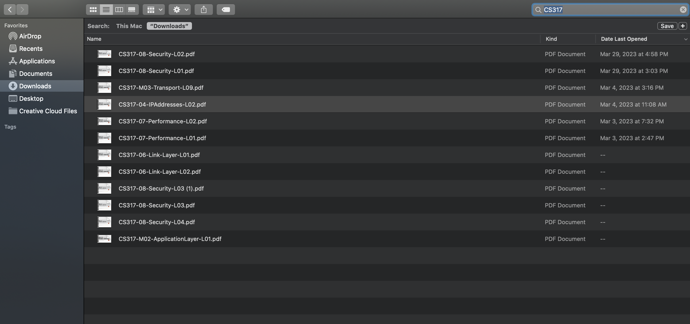

<!-- ABOUT THE PROJECT -->
## Table of contents

* [About This Project](#about-this-project)
* [Running Script Locally](#running-script-locally)

## About This Project
Do you often find yourself downloading multiple related or identical documents on the same topic repeatedly, only to have them clutter your Downloads directory and consume valuable disk space? As a student frequently downloading assignment documents and lecture notes, I've certainly encountered this issue, which disrupts the organization of my Downloads folder. 

Like the example above, I downloaded multiple files for my CS317 course, which should ideally be organized into the same folder titled "CS317".

To tackle this inconvenience and automate the process, I developed a python script. This script efficiently manages newly downloaded files by automatically gathering similar ones and neatly organizing them into a designated folder. Furthermore, it actively identifies duplicate files and prompts users for deletion, streamlining file management and optimizing disk space usage.

### Built With
* <i class="fa-brands fa-python"></i> Python

## Running Script Locally
1) install [Python 3](https://www.python.org/downloads/)
2) install any missing libraries like watchdog, shutil, thefuzz ...etc
`$ pip install watchdog shutil thefuzz`
4) modify the directory you want to organize
5) adjust the similarity `threshold` here to specify the level of similarity required for file names to be grouped into the same folder. Notice here we are using [fuzzy string matching](https://www.datacamp.com/tutorial/fuzzy-string-python) ...For example, if I have a series of files named: CPSC317-01-Intro.pdf, CPSC317-02-Security.pdf, CPSC317-03-Transport.pdf...etc, then the threshold should be set lower than a series of files named PHIL-lecture1, PHIL-lecture2, PHIL-lecture 3...
3) in the project directory command line, run 
`main.py`

<!-- USAGE EXAMPLES -->
## Usage

<!-- ROADMAP -->
## Roadmap

- [x] Basic template & styling

<!-- ACKNOWLEDGMENTS -->
## Acknowledgments

These are some resources I would like to give credit to.